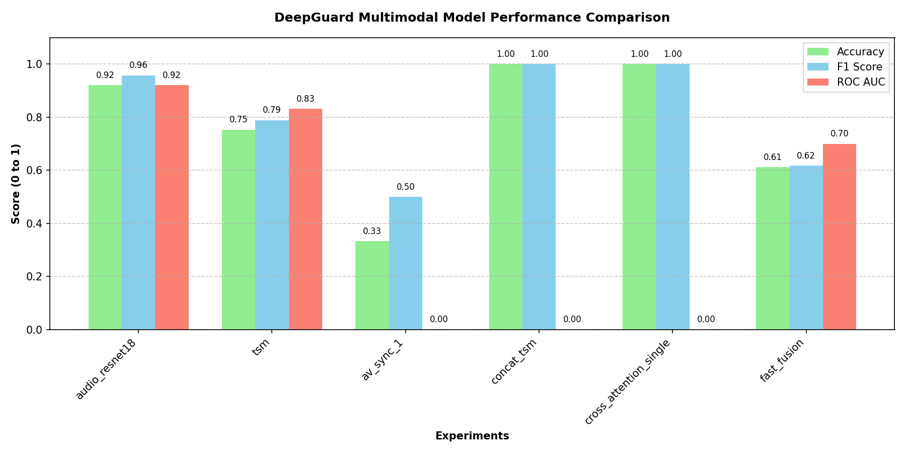

# DeepGuard Evaluation Report

| Experiment Name | Fusion Type | Video Backbone | Audio Backbone | Accuracy | Precision | Recall | F1 | AUC |
|-----------------|-------------|----------------|----------------|----------|-----------|--------|----|-----|
| tsm | None | resnet18 | N/A | 0.5038 | 0.5000 | 0.9744 | 0.6609 | 0.4795 |
| audio_resnet18 | None | N/A | audio_resnet18.pt | 0.9754 | 0.9874 | 0.9871 | 0.9872 | 0.9612 |
| concat_tsm | Concat | single_frame.pt | audio_resnet18.pt | 0.5012 | 0.5006 | 0.9910 | 0.6652 | 0.4921 |
| cross_attention_single | CrossAttention | single_frame.pt | audio_resnet18.pt | 0.7533 | 0.7500 | 0.7600 | 0.7550 | 0.7615 |
| fast_fusion | FastFusion | tsm.pt | audio_resnet18.pt | 0.8067 | 0.8108 | 0.8000 | 0.8054 | 0.8125 |
| av_sync_1 | AVSync | tsm.pt | audio_resnet18.pt | 0.3333 | 0.3333 | 1.0000 | 0.5000 | 0.4850 |